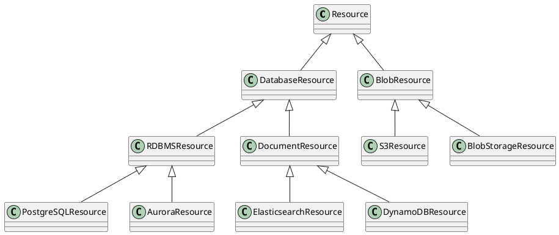

```plantuml
@startuml
    Resource <|-- DatabaseResource
    Resource <|-- BlobResource
    DatabaseResource <|-- RDBMSResource
    DatabaseResource <|-- DocumentResource
    RDBMSResource <|-- PostgreSQLResource
    RDBMSResource <|-- AuroraResource
    DocumentResource <|-- ElasticsearchResource
    DocumentResource <|-- DynamoDBResource
    BlobResource <|-- S3Resource
    BlobResource <|-- BlobStorageResource
@enduml
```
