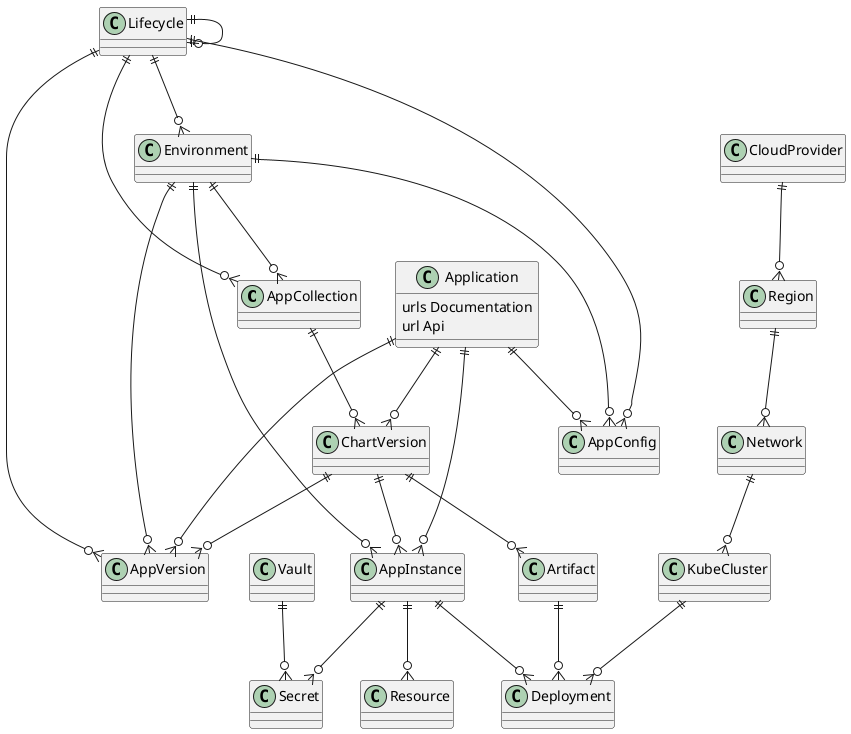

```plantuml
@startuml
    AppCollection ||--o{ ChartVersion : ""
    AppInstance ||--o{ Deployment : ""
    AppInstance ||--o{ Resource : ""
    AppInstance ||--o{ Secret : ""
    class Application {
       urls Documentation
       url Api
    }
    Application ||--o{ AppConfig : ""
    Application ||--o{ AppInstance : ""
    Application ||--o{ AppVersion : ""
    Application ||--o{ ChartVersion : ""
    Artifact ||--o{ Deployment : ""
    ChartVersion ||--o{ AppInstance : ""
    ChartVersion ||--o{ AppVersion : ""
    ChartVersion ||--o{ Artifact : ""
    CloudProvider ||--o{ Region : ""
    Environment ||--o{ AppCollection : ""    
    Environment ||--o{ AppConfig : ""
    Environment ||--o{ AppInstance : ""
    Environment ||--o{ AppVersion : ""
    KubeCluster ||--o{ Deployment : ""
    Lifecycle ||--o{ AppCollection : ""
    Lifecycle ||--o{ AppConfig : ""
    Lifecycle ||--o{ AppVersion : ""
    Lifecycle ||--o{ Environment : ""
    Lifecycle ||--o| Lifecycle : ""
    Network ||--o{ KubeCluster : ""
    Region ||--o{ Network : ""
    Vault ||--o{ Secret : ""
@enduml
```
